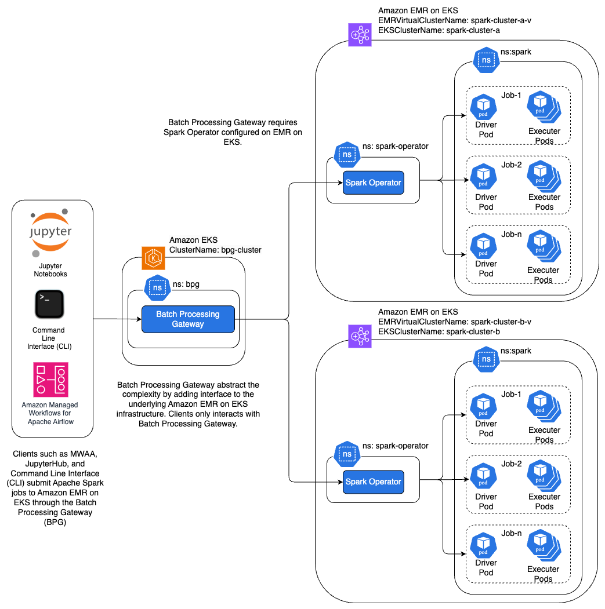

# Use Batch Processing Gateway to automate job management in multi-cluster Amazon EMR on EKS environments  

## 1. Introduction 

This repository accompanies the AWS Big Data Blog post [Use Batch Processing Gateway to automate job management in multi-cluster Amazon EMR on EKS environments](https://aws.amazon.com/blogs/big-data/use-batch-processing-gateway-to-automate-job-management-in-multi-cluster-amazon-emr-on-eks-environments/). It provides guidance on implementing [Batch Processing Gateway(BPG)](https://github.com/apple/batch-processing-gateway) on an [Amazon EKS](https://aws.amazon.com/eks/) cluster and routing Apache Spark jobs across multiple [Amazon EMR on EKS](https://docs.aws.amazon.com/emr/latest/EMR-on-EKS-DevelopmentGuide/emr-eks.html) clusters.

## 2. Problem Statement

In a multi-cluster environment, Spark jobs on Amazon EMR on EKS need to be submitted to different clusters from various clients. This architecture introduces several key challenges:
- **Endpoint management** – Clients must maintain and update connections for each target cluster
- **Operational overhead** – Managing multiple client connections individually increases the complexity and operational burden
- **Workload distribution** – There is no built-in mechanism for job routing across multiple clusters, which impacts configuration, resource allocation, cost transparency, and resilience
- **Resilience and high availability** – Without load balancing, the environment lacks fault tolerance and high availability


BPG addresses these challenges by providing a single point of submission for Spark jobs. BPG automates job routing to the appropriate EMR on EKS clusters, providing effective load balancing, simplified endpoint management, and improved resilience. The proposed solution is particularly beneficial for customers with multi-cluster Amazon EMR on EKS setups using the [Spark Kubernetes Operator](https://github.com/kubeflow/spark-operator) or [Yunikorn scheduler](https://docs.aws.amazon.com/emr/latest/EMR-on-EKS-DevelopmentGuide/tutorial-yunikorn.html). 

## 3. Limitations
Although BPG offers significant benefits, it is currently designed to work only with Spark Operator. Additionally, BPG has not been tested with the [Volcano scheduler](https://volcano.sh/en/), and the solution is not applicable in environments using [native Amazon EMR on EKS APIs](https://docs.aws.amazon.com/emr/latest/EMR-on-EKS-DevelopmentGuide/job-runs.html).

## 4. Solution Overview 
The proposed solution involves implementing BPG for multiple underlying EMR on EKS clusters, which effectively resolves the drawbacks discussed earlier. The following diagram illustrates the details of the solution. 



## 5. Prerequisites

Before deploying this solution, ensure the following prerequisites are in place:
-	Access to a valid [AWS account](https://signin.aws.amazon.com/signin?redirect_uri=https%3A%2F%2Fportal.aws.amazon.com%2Fbilling%2Fsignup%2Fresume&client_id=signup)
- The [AWS Command Line Interface](http://aws.amazon.com/cli) (AWS CLI) [installed](https://docs.aws.amazon.com/cli/latest/userguide/getting-started-install.html) on your local machine 
- [```git```](https://github.com/git-guides/install-git)
, [```docker```](https://docs.docker.com/engine/install/), [```eksctl```](https://docs.aws.amazon.com/eks/latest/userguide/eksctl.html),[```kubectl```](https://docs.aws.amazon.com/eks/latest/userguide/install-kubectl.html), [```helm```](https://helm.sh/docs/intro/install/), [```jq```](https://jqlang.github.io/jq/) and [```yq```](https://mikefarah.gitbook.io/yq) installed on your local machine
-	Permission to create AWS resources
- Familiarity with [Kubernetes](https://kubernetes.io/), [Amazon EKS](https://aws.amazon.com/eks/), and [Amazon EMR on EKS](https://docs.aws.amazon.com/emr/latest/EMR-on-EKS-DevelopmentGuide/emr-eks.html)

## 6. Clone the repos

We assume that all repositories are cloned into the home directory (~/). All relative paths provided are based on this assumption. If you have cloned the repositories to a different location, adjust the paths accordingly.

#### Batch Processing Gateway on EMR on EKS

```sh
cd ~/
git clone git@github.com:aws-samples/batch-processing-gateway-on-emr-on-eks.git
```

####  Batch Processing Gateway

**Disclaimer**: 
The Batch Processing Gateway repository is currently under active development. To provide a stable deployment experience consistent with the provided instructions, we have pinned the repository to the latest stable commit hash at the time this code was published. We have tested the solution against commit ```aa3e5c8be973bee54ac700ada963667e5913c865```. Before cloning the repository, please verify any security updates and adhere to your organization's security practices.

```sh
git clone git@github.com:apple/batch-processing-gateway.git
cd batch-processing-gateway
git checkout aa3e5c8be973bee54ac700ada963667e5913c865
```

## 7. Deploy the solution

#### 7.1 [Setup Amazon EMR on EKS clusters and run Spark jobs with the Spark operator](emr-on-eks/README.md)
#### 7.2 [Setup Batch Processing Gateway on Amazon EKS and Submit Spark jobs to Amazon EMR on EKS clusters](bpg/README.md) 

## 8. Testing the solution
Submit multiple Apache Spark job by executing the below sample code multiple times. The below code submits the SparkPi Spark job to the Batch Processing Gateway. 

#### 8.1 Set the kubectl context to ```bpg``` cluster

```sh
kubectl config get-contexts | awk 'NR==1 || /bpg-cluster/'
kubectl config use-context "<CONTEXT_NAME>"
```

#### 8.2 Identify the ```bpg``` pod name

```sh
kubectl get pods --namespace bpg
```
<Details>
Sample Output:

```
NAME                              READY   STATUS    RESTARTS         AGE
bpg-75cc6d64c-g5fkp               1/1     Running   0                5h42m
bpg-helper-774d4ff54-2xqft        1/1     Running   32 (5h51m ago)   8h
bpg-swagger-ui-5886d9d47f-qx289   1/1     Running   0                8h

```
</Details>


#### 8.3  Exec into the ```bpg``` pod and submit multple Spark jobs using ```curl``` command

**Disclaimer**: Batch Processing Gateway does not include authentication out of the box. For more information, please refer to the [Auth](https://github.com/apple/batch-processing-gateway?tab=readme.-ov-file#auth) section. Ensure that you follow your organization’s best practices for securing the endpoints.

Execute the ```exec``` and then run the ```curl``` command multiple times as shown below. Note that ```user:pass```
is a placeholder for a future authentication module and does not currently provide any authentication.

```sh
kubectl exec -it <bpg-podname> -n bpg -- bash

curl -u user:pass localhost:8080/skatev2/spark -i -X POST \
-H 'Content-Type: application/json' \
    -d '{
        "applicationName": "SparkPiDemo",
        "queue": "dev",
        "sparkVersion": "3.5.0",
        "mainApplicationFile": "local:///usr/lib/spark/examples/jars/spark-examples.jar",
        "mainClass":"org.apache.spark.examples.SparkPi",
        "driver": {
          "cores": 1,
          "memory": "2g",
          "serviceAccount": "emr-containers-sa-spark",
          "labels":{
            "version": "3.5.0"
          }
        },
        "executor": {
            "instances": 1,
            "cores": 1,
            "memory": "2g",
            "labels":{
                "version": "3.5.0"
            }
        }
    }'
```
After each submission, BPG will inform you of the cluster to which the job was submitted. For example:

```sh
HTTP/1.1 200 OK
Date: Sat, 10 Aug 2024 16:17:15 GMT
Content-Type: application/json
Content-Length: 67

{"submissionId":"spark-cluster-a-f72a7ddcfde14f4390194d4027c1e1d6"}
{"submissionId":"spark-cluster-a-d1b359190c7646fa9d704122fbf8c580"}
{"submissionId":"spark-cluster-b-7b61d5d512bb4adeb1dd8a9977d605df"}
```

#### 8.4  Verify that the jobs are running in the EMR cluster ```spark-cluster-a``` and ```spark-cluster-b``` 

```sh
kubectl config get-contexts | awk 'NR==1 || /spark-cluster-(a|b)/'
kubectl get pods -n spark-operator --context "<CONTEXT_NAME>"
```

<Details>
Depending on the number of times the job was submitted, you should see something similar to the output below:

```
NAME                                                      READY   STATUS      RESTARTS   AGE
spark-cluster-a-05f147d9675d4b358552c00b8bf5ef62-driver   0/1     Completed   0          14m
spark-cluster-a-982b374829e74fa8b56a0204833217b6-driver   0/1     Completed   0          14m
spark-operator-demo-557c55c785-dszbj                      1/1     Running     0          166m
```
</Details>

You can view the Driver logs to find the value of Pi as shows below:

```
kubectl logs <spark driver pod name> --namespace spark-operator --context "<CONTEXT_NAME>"
```

After successful completion of the job, you should be able to see the below message in the logs:

```
Pi is roughly 3.1452757263786317
```

You can also further introspect the SparkApplication as below:

```
kubectl get sparkapplications --namespace spark-operator --context "<CONTEXT_NAME>"
```

<Details>
Depending on the number of times the job was submitted, you should see something similar to the output below:

```
NAME                                               STATUS      ATTEMPTS   START                  FINISH                 AGE
spark-cluster-a-05f147d9675d4b358552c00b8bf5ef62   COMPLETED   1          2024-09-07T20:55:58Z   2024-09-07T20:55:58Z   20m
spark-cluster-a-982b374829e74fa8b56a0204833217b6   COMPLETED   1          2024-09-07T20:56:07Z   2024-09-07T20:56:07Z   20m
```
</Details>

You can check events for the SparkApplication object with the following command:

```
kubectl describe sparkapplication  <Spark Application Name> --namespace spark-operator --context "<CONTEXT_NAME>"
```

## 9. Cleanup

```sh
# Delete Amazon EMR on EKS Virtual Cluster 
VIRTUAL_CLUSTER_ID=$(aws emr-containers list-virtual-clusters --region="$AWS_REGION" --query "virtualClusters[?name=='spark-cluster-a-v' && state=='RUNNING'].id" --output text)

aws emr-containers delete-virtual-cluster --region="$AWS_REGION" --id "$VIRTUAL_CLUSTER_ID"

VIRTUAL_CLUSTER_ID=$(aws emr-containers list-virtual-clusters --region="$AWS_REGION" --query "virtualClusters[?name=='spark-cluster-b-v' && state=='RUNNING'].id" --output text)

aws emr-containers delete-virtual-cluster --region="$AWS_REGION" --id "$VIRTUAL_CLUSTER_ID" 

# Delete the IAM Role
aws iam delete-role-policy --role-name sparkjobrole --policy-name EMR-Spark-Job-Execution
aws iam delete-role --role-name sparkjobrole

# Delete RDS Instance and DB
aws rds delete-db-instance \
    --db-instance-identifier bpg \
    --skip-final-snapshot
aws rds delete-db-cluster \
    --db-cluster-identifier bpg \
    --skip-final-snapshot

# Delete bpg-rds-securitygroup Security Group
BPG_SG=$(aws ec2 describe-security-groups --filters "Name=group-name,Values=bpg-rds-securitygroup" --query "SecurityGroups[*].GroupId" --output text)
aws ec2 delete-security-group --group-id "$BPG_SG"

# Delete Amazon EKS clusters
eksctl delete cluster --region="$AWS_REGION" --name=bpg-cluster
eksctl delete cluster --region="$AWS_REGION" --name=spark-cluster-a
eksctl delete cluster --region="$AWS_REGION" --name=spark-cluster-b

# Delete bpg ECR repository:
aws ecr delete-repository --repository-name bpg --region="$AWS_REGION" --force

# Delete Keypairs
aws ec2 delete-key-pair --key-name ekskp
aws ec2 delete-key-pair --key-name emrkp
```

## 10. Contributing

See [CONTRIBUTING](CONTRIBUTING.md#security-issue-notifications) for more information.

## 11. License

See the [LICENSE](/LICENSE) for more information.

## 12. Disclaimer

This solution deploys the Open Source Batch Processing Gateway (BPG) in the AWS cloud. BPG is an external open source project, and AWS makes no claims regarding its security properties. Please evaluate BPG according to your organization's security best practices.
