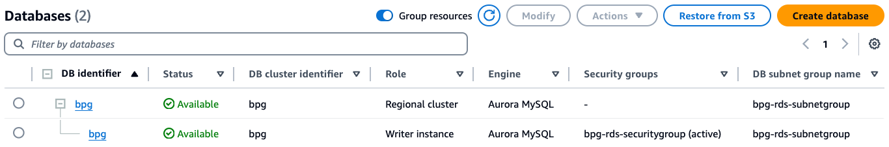

# Set up Batch Processing Gateway on Amazon EKS and Submit Spark jobs to Amazon EMR on EKS clusters

## 1. Change to appropriate directory

```sh
cd ~/batch-processing-gateway-on-emr-on-eks/bpg/
```


## 2. Set Region

```sh
export AWS_REGION=<AWS_REGION>
```

## 3. Create key pair
See the official guidance on how to [Create a Key Pair](https://docs.aws.amazon.com/AWSEC2/latest/UserGuide/create-key-pairs.html)
Ensure that you follow your organization’s best practices for Keypair management.

```sh
aws ec2 create-key-pair \
--region "$AWS_REGION" \
--key-name ekskp \
--key-type ed25519 \
--key-format pem \
--query "KeyMaterial" \
--output text > ekskp.pem

chmod 400 ekskp.pem
ssh-keygen -y -f ekskp.pem > eks_publickey.pem
chmod 400 eks_publickey.pem
```

## 4. Create EKS Cluster

#### 4.1 Get Public Subnets of your default VPC

**Disclaimer**: For the purposes of this post, we utilized the default VPC for deploying the solution. Please modify the steps below to deploy the solution into the appropriate VPC in accordance with your organization’s best practices.See the official guidance on how to [Create a VPC](https://docs.aws.amazon.com/vpc/latest/userguide/create-vpc.html)

**Note**: Filtering out us-east-1e subnet due to its known limitation in supporting the Amazon EKS control plane.This Availability Zone (AZ) in the `us-east-1` region does not reliably support EKS cluster control planes,and attempting to use it can result in errors or failed deployments. To ensure smooth cluster creation,we exclude it from the list of default subnets when passing subnets to the eksctl create cluster command.

**Error Message**: "Cannot create cluster "<spark cluster name>" because EKS does not support creating control plane instances in us-east-le, the targeted availability zone. Retry cluster creation using control plane subnets that span at least two of these availability zone. 

```sh
export  DEFAULT_FOR_AZ_SUBNET=$(aws ec2 describe-subnets --region "$AWS_REGION" --filters "Name=default-for-az,Values=true" --query "Subnets[?AvailabilityZone != 'us-east-1e'].SubnetId" | jq -r '. | map(tostring) | join(",")')
```

#### 4.2 Create cluster

```sh
eksctl create cluster \
--name bpg-cluster \
--region "$AWS_REGION" \
--vpc-public-subnets "$DEFAULT_FOR_AZ_SUBNET" \
--with-oidc \
--ssh-access \
--ssh-public-key eks_publickey.pem \
--instance-types=m5.xlarge \
--managed
```

## 5. Code Changes

#### 5.1 Replace `pom.xml`

```sh
cp ~/batch-processing-gateway-on-emr-on-eks/bpg/pom.xml ~/batch-processing-gateway/pom.xml
```

<Details>
The source file includes the MySQL driver necessary for connecting to an Amazon Aurora MySQL database.

```xml
<dependency>
    <groupId>mysql</groupId>
    <artifactId>mysql-connector-java</artifactId>
    <version>8.0.30</version>
</dependency>
```
</Details>

#### 5.2 Replace `LogDao.java`

```sh
cp ~/batch-processing-gateway-on-emr-on-eks/bpg/LogDao.java ~/batch-processing-gateway/src/main/java/com/apple/spark/core/LogDao.java
```

<Details>
The source file has an updated SQL statement for the creation of the `logindex` table.

```java
"hour" SMALLINT NOT NULL,
" to `hour` SMALLINT NOT NULL,
"
```
</Details>

#### 5.3 Replace Dockerfile

```sh
cp ~/batch-processing-gateway-on-emr-on-eks/bpg/Dockerfile ~/batch-processing-gateway/Dockerfile
```

<Details>
The source file has the updated URL for Maven installation to include the MySQL driver files.

```Dockerfile
RUN curl https://archive.apache.org/dist/maven/maven-3/3.8.6/binaries/apache-maven-3.8.6-bin.zip -o apache-maven-3.8.6-bin.zip
```
</Details>

## 6. Docker Image

#### 6.1 Create an ECR Repository

```sh
aws ecr create-repository --repository-name bpg --region "$AWS_REGION"
```
#### 6.2 Get AWS Account Id

```sh
export AWS_ACCOUNT_ID=$(aws sts get-caller-identity --query "Account" --output text)
```

#### 6.3 Authenticate Docker to Your ECR Registry

```sh
aws ecr get-login-password --region "$AWS_REGION" | docker login --username AWS --password-stdin "$AWS_ACCOUNT_ID".dkr.ecr."$AWS_REGION".amazonaws.com
```

#### 6.4 Build Your Docker Image

```sh
cd ~/batch-processing-gateway/
```

```sh
docker build \
  --platform linux/amd64 \
  --build-arg VERSION="1.0.0" \
  --build-arg BUILD_TIME=$(date -u +"%Y-%m-%dT%H:%M:%SZ") \
  --build-arg GIT_COMMIT=$(git rev-parse HEAD) \
  --progress=plain \
  --no-cache \
  -t bpg:1.0.0 .
```
Note: The ```ImagePullPolicy``` in the the [batch-processing-gateway](https://github.com/apple/batch-processing-gateway/blob/main/helm/batch-processing-gateway/templates/deployment.yaml#L23) github repo is set to ```IfNotPresent``. Please update the image tag in case you need to update the image. 

#### 6.5 Tag Your Image

```sh
docker tag bpg:1.0.0 $AWS_ACCOUNT_ID.dkr.ecr.$AWS_REGION.amazonaws.com/bpg:1.0.0
```

#### 6.6 Push the Image to Your ECR Repository

```sh
docker push $AWS_ACCOUNT_ID.dkr.ecr.$AWS_REGION.amazonaws.com/bpg:1.0.0
```

## 7. Amazon RDS Setup

#### 7.1 List all default subnets for the given availability-zone in a specific format
```sh
DEFAULT_FOR_AZ_SUBNET_RFMT=$(aws ec2 describe-subnets --region "$AWS_REGION" --filters "Name=default-for-az,Values=true" --query "Subnets[*].SubnetId" | jq -c '.')
```

#### 7.2 Create a Subnet Group

```sh
aws rds create-db-subnet-group \
    --db-subnet-group-name bpg-rds-subnetgroup \
    --db-subnet-group-description "BPG Subnet Group for RDS" \
    --subnet-ids "$DEFAULT_FOR_AZ_SUBNET_RFMT" \
    --region "$AWS_REGION"
```
Refer to [create-db-subnet-group](https://docs.aws.amazon.com/cli/latest/reference/rds/create-db-subnet-group.html) for more details

#### 7.3 List default VPC

```sh
export DEFAULT_VPC=$(aws ec2 describe-vpcs --region "$AWS_REGION" --filters "Name=isDefault,Values=true" --query "Vpcs[0].VpcId" --output text)
```

#### 7.4 Create Security Group

```sh
aws ec2 create-security-group \
    --group-name bpg-rds-securitygroup \
    --description "BPG Security Group for RDS" \
    --vpc-id "$DEFAULT_VPC" \
    --region "$AWS_REGION"
```

Refer to [create-security-group](https://docs.aws.amazon.com/cli/latest/reference/ec2/create-security-group.html) for more details

#### 7.5 List the ```bpg-rds-securitygroup``` security-group id

```sh
export BPG_RDS_SG=$(aws ec2 describe-security-groups --filters "Name=group-name,Values=bpg-rds-securitygroup" --query "SecurityGroups[*].GroupId" --output text)
```

#### 7.6 Create the Aurora DB Cluster

```sh
aws rds create-db-cluster \
    --database-name bpg \
    --db-cluster-identifier bpg \
    --engine aurora-mysql \
    --engine-version 8.0.mysql_aurora.3.06.1 \
    --master-username admin \
    --manage-master-user-password \
    --db-subnet-group-name bpg-rds-subnetgroup \
    --vpc-security-group-ids "$BPG_RDS_SG" \
    --region "$AWS_REGION"
```
Refer to [create-db-cluster](https://docs.aws.amazon.com/cli/latest/reference/rds/create-db-cluster.html) for more details

#### 7.7 Create a DB Instance in the Cluster

```sh
aws rds create-db-instance \
    --db-instance-identifier bpg \
    --db-cluster-identifier bpg \
    --db-instance-class db.r5.large \
    --engine aurora-mysql \
    --region "$AWS_REGION"
```

On AWS Console, navigate to Amazon RDS and click on Databases link on the left pane to see the details. The ```bpg``` Reader and Writer instances should be in Available status.



## 8. Network Connectivity
Security groups for EKS clusters are typically associated with the nodes and the control plane (if using managed nodes). In this section, we will configure the networking to allow the Node Security Group of the ```bpg-cluster``` to communicate with ```spark-cluster-a```, ```spark-cluster-b```, and ```bpg``` RDS cluster.

#### 8.1 Identify the Security Groups of ```bpg-cluster```, ```spark-cluster-a```, ```spark-cluster-b```, and ```bpg``` RDS cluster

```sh
# Identify Node Security Group of the bpg-cluster
BPG_CLUSTER_NODEGROUP_SG=$(aws ec2 describe-instances \
  --filters Name=tag:eks:cluster-name,Values=bpg-cluster \
  --query "Reservations[*].Instances[*].SecurityGroups[?contains(GroupName, 'eks-cluster-sg-bpg-cluster-')].GroupId" \
  --region "$AWS_REGION" \
  --output text | uniq
)

# Idetinfy Cluster security group of spark-cluster-a and spark-cluster-b
SPARK_A_CLUSTER_SG=$(aws eks describe-cluster --name spark-cluster-a --query "cluster.resourcesVpcConfig.clusterSecurityGroupId" --output text)
SPARK_B_CLUSTER_SG=$(aws eks describe-cluster --name spark-cluster-b --query "cluster.resourcesVpcConfig.clusterSecurityGroupId" --output text)

# Idetinfy Cluster security group of bpg RDS Aurora Cluster Writer Instance
BPG_RDS_WRITER_SG=$(aws ec2 describe-security-groups --filters "Name=group-name,Values=bpg-rds-securitygroup" --query  "SecurityGroups[*].GroupId" --output text)
```

#### 8.2  Allow ```Node Security Group``` of the ```bpg-cluster``` to communicate with ```spark-cluster-a``` , ```spark-cluster-b``` and Amazon RDS

```sh
# spark-cluster-a
aws ec2 authorize-security-group-ingress --group-id "$SPARK_A_CLUSTER_SG" --protocol tcp --port 443 --source-group "$BPG_CLUSTER_NODEGROUP_SG"

# spark-cluster-b
aws ec2 authorize-security-group-ingress --group-id "$SPARK_B_CLUSTER_SG" --protocol tcp --port 443 --source-group "$BPG_CLUSTER_NODEGROUP_SG"

# bpg-rds
aws ec2 authorize-security-group-ingress --group-id "$BPG_RDS_WRITER_SG" --protocol tcp --port 3306 --source-group "$BPG_CLUSTER_NODEGROUP_SG"
```

## 9 BPG Deployment

#### 9.1 Get ```bpg``` context

```sh
BPG_CLUSTER_CONTEXT=$(kubectl config view --output=json | jq -r '.contexts[] | select(.name | contains("bpg-cluster")) | .name')
kubectl config use-context "$BPG_CLUSTER_CONTEXT"
```

#### 9.1 Create a Kuberbetes Namespace for BPG

```sh
kubectl create namespace bpg
```

#### 9.2 Generate values.yaml file
The helm chart for BPG required a ```values.yaml``` file. This file includes various ```key-value``` pairs for each Amazon EMR on EKS cluster, Amazon RDS cluster, and Amazon S3 bucket. Manually updating the ```values.yaml``` can be cumbersome.
To streamline this process, we've automated the creation of the ```values.yaml``` file.
Please execute the following script to generate the values.yaml file."


```sh
cd ~/batch-processing-gateway-on-emr-on-eks/bpg
chmod 755 create-bpg-values-yaml.sh
./create-bpg-values-yaml.sh
```

#### 9.3 Deploy the Helm Chart

Please ensure that the ```image.tag``` value in both ```values.template.yaml``` and ```values.yaml``` matches the Docker image tag specified in Step 6.5.

```sh
cp ~/batch-processing-gateway/helm/batch-processing-gateway/values.yaml ~/batch-processing-gateway/helm/batch-processing-gateway/values.yaml.$(date +'%Y%m%d%H%M%S') \
&& cp ~/batch-processing-gateway-on-emr-on-eks/bpg/values.yaml ~/batch-processing-gateway/helm/batch-processing-gateway/values.yaml \
&& cd ~/batch-processing-gateway/helm/batch-processing-gateway/

kubectl config use-context "$BPG_CLUSTER_CONTEXT"

helm install batch-processing-gateway . --values values.yaml -n bpg
```


#### 9.4 Verify the deployment by listing he pods and viewing the pod logs
```sh
kubectl get pods --namespace bpg
```
<Details>
Sample Output:

```
NAME                              READY   STATUS    RESTARTS         AGE
bpg-75cc6d64c-g5fkp               1/1     Running   0                5h42m
bpg-helper-774d4ff54-2xqft        1/1     Running   32 (5h51m ago)   8h
bpg-swagger-ui-5886d9d47f-qx289   1/1     Running   0                8h

```
</Details>

```sh
kubectl logs  <bpg_pod_name> --namespace bpg
```

#### 9.5 Verify Health Check

Exec into the BPG pod and verify the health check:

```sh
kubectl exec -it <bpg-podname> -n bpg -- bash
curl -u admin:admin localhost:8080/skatev2/healthcheck/status
```
Output:

```json
{"status":"OK"}
```

Batch Processing Gateway is successfully deployed on Amazon EKS cluster.
