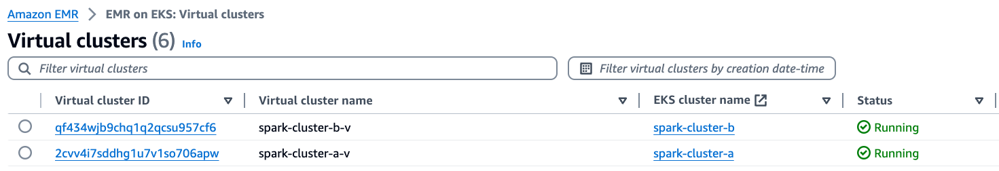

# Setting up Amazon EMR on EKS clusters with Spark operator

This ```README``` provides automated steps to create Amazon EMR on EKS clusters and Spark operator. For detailed instructions refer to [README-Advdanced.md](README-Advanced.md)

#### 1. Change to appropriate directory

```sh
cd ~/batch-processing-gateway-on-emr-on-eks/emr-on-eks/
```

#### 2. Set the below variables

```sh
export AWS_REGION=<AWS-REGION>
export KEY_RELATIVE_PATH=emr_publickey.pem
```

#### 3. Create key pair
See the official guidance on how to [Create a Key Pair](https://docs.aws.amazon.com/AWSEC2/latest/UserGuide/create-key-pairs.html).
Ensure that you follow your organization’s best practices for Keypair management.

```sh
aws ec2 create-key-pair \
--region "$AWS_REGION" \
--key-name emrkp \
--key-type ed25519 \
--key-format pem \
--query "KeyMaterial" \
--output text > emrkp.pem

chmod 400 emrkp.pem
ssh-keygen -y -f emrkp.pem > emr_publickey.pem
chmod 400 emr_publickey.pem
```

#### 4. Execute the below script 

**Disclaimer**: For the purposes of this post, we utilized the default VPC for deploying the solution. Please modify the script below to deploy the solution into the appropriate VPC in accordance with your organization’s best practices.See the official guidance on how to [Create a VPC](https://docs.aws.amazon.com/vpc/latest/userguide/create-vpc.html)

**Note** 

- Verifiy the presence of `AWSServiceRoleForAmazonEMRContainers` IAM service linked role in your account using below command: `aws iam get-role --role-name AWSServiceRoleForAmazonEMRContainers`
- If it does not exists, create the Service Linked role using below command before executing `create_emr_eks.sh` script: `aws iam create-service-linked-role --aws-service-name emr-containers.amazonaws.com`
- The create_emr_eks.sh step will take approximately 40 minutes to complete the creation of two clusters

```sh
./create_emr_eks.sh spark-cluster-a spark-cluster-b

```

#### 5. Verify the successful creation of the ```spark-cluster-a-v``` and ```spark-cluster-b-v``` EMR on EKS cluster

Log in to the AWS Management Console, go to the EMR service, and click on EMR on EKS in the left-hand menu to view the virtual clusters



#### 5. (Optional) Execute Spark job in ```spark-cluster-a-v``` and ```spark-cluster-b-v``` to test the setup

Navigate to [README-Spark.md](README-Spark.md) and follow the steps to run Spark jobs.
